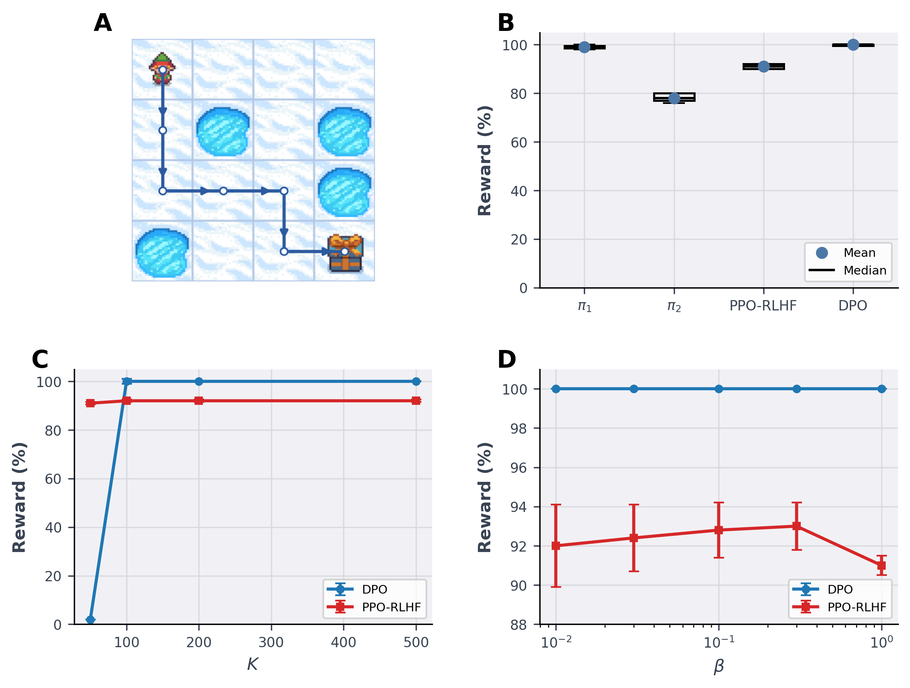
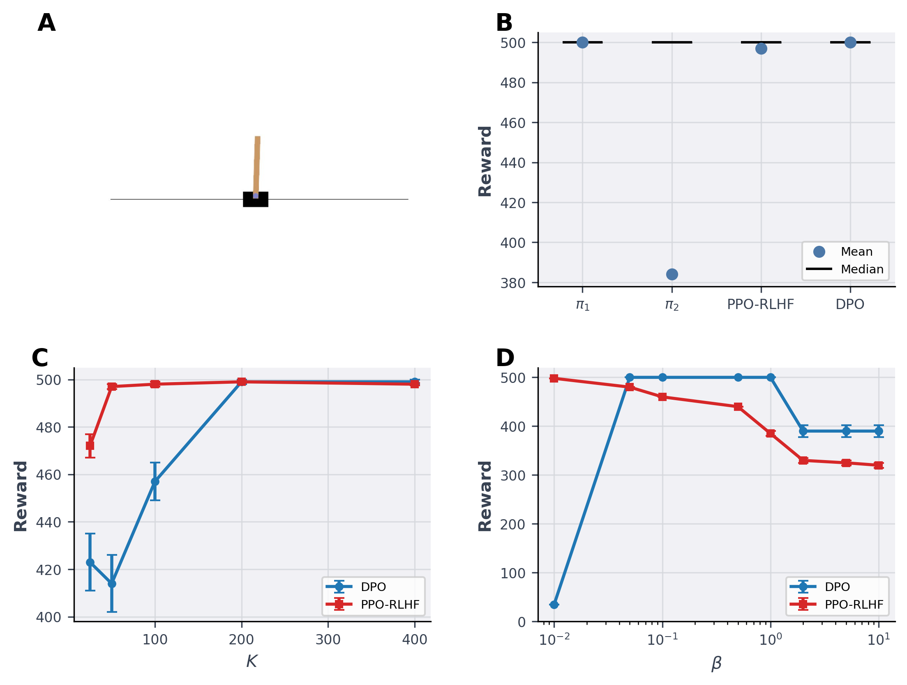
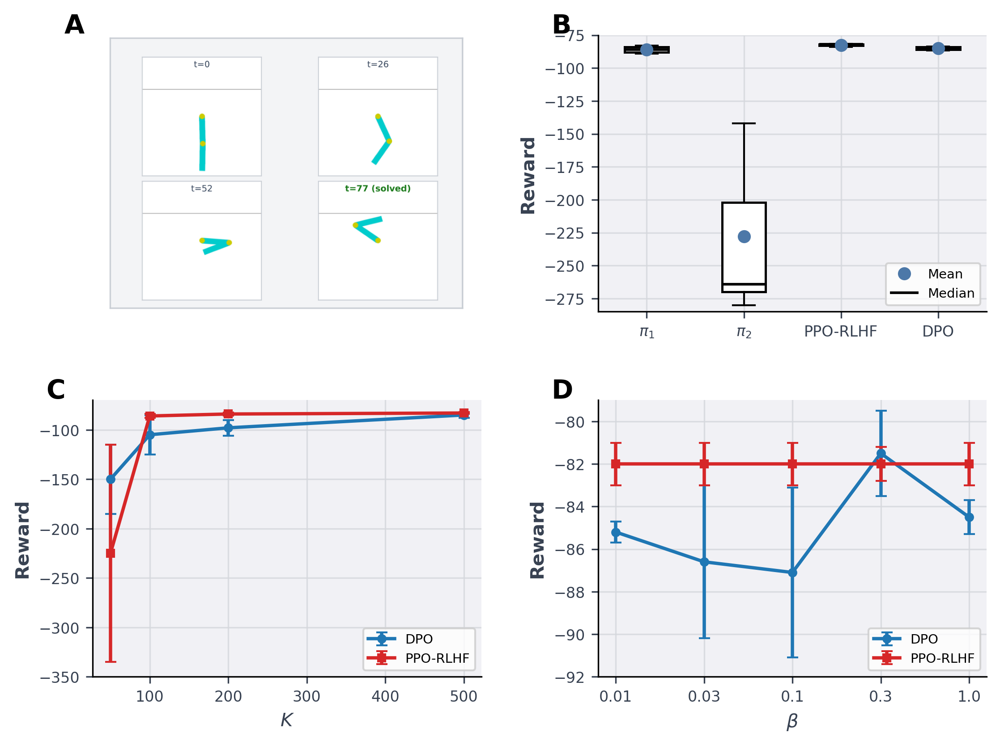
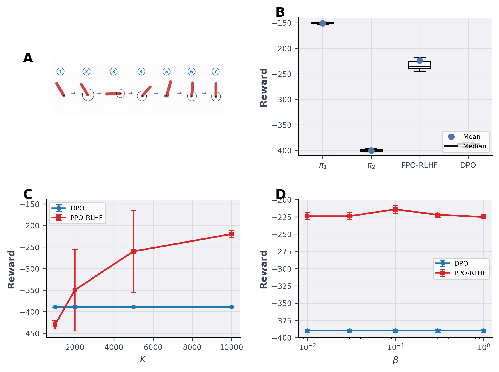
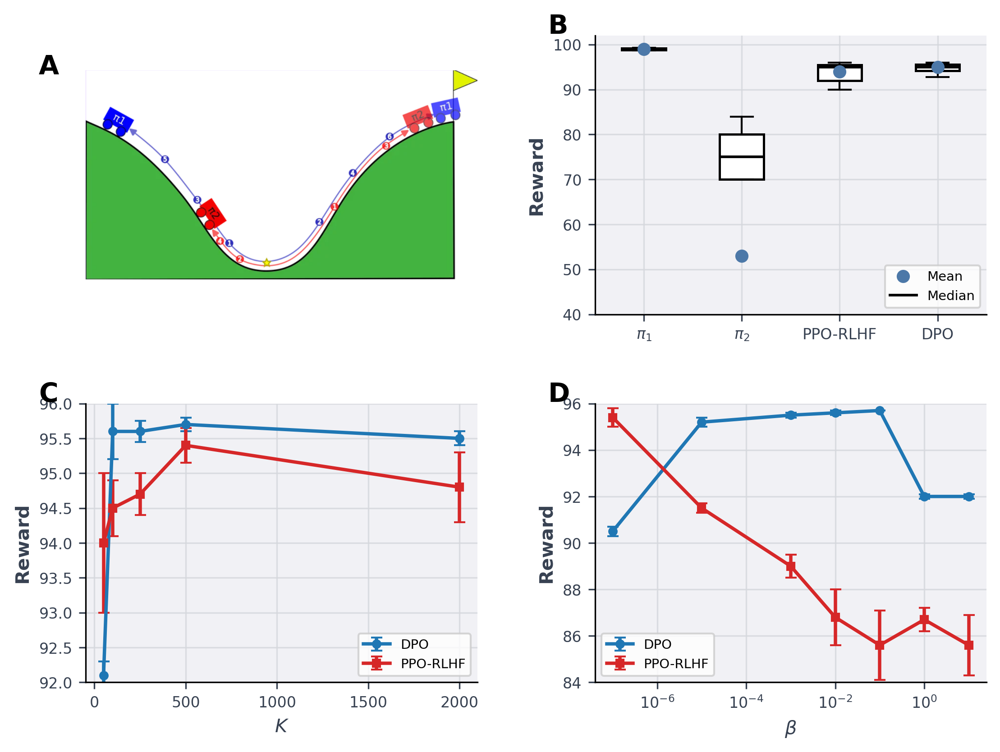

# Applied Project 2 - Reinforcement Learning from Human Feedback

**Course:** Reinforcement Learning, EE-568 / EE 58, EPFL  
**Instructor:** Prof. Volkan Cevher  
**Assignment:** Applied Project 2 — Reinforcement Learning from Human Feedback  

## Short description

Preference-based RL project comparing PPO-RLHF and DPO across FrozenLake, CartPole, Acrobot, Pendulum, and MountainCarContinuous using synthetic trajectory preferences, 3-seed evaluation, K-sweeps, and beta-sweeps.

## Overview

This repository contains the code, notebooks, saved results, and report figures for Applied Project 2 in the EPFL Reinforcement Learning course. The project compares **PPO-based reinforcement learning from human feedback (PPO-RLHF)** with **Direct Preference Optimization (DPO)** under matched synthetic preference-data conditions.

The main goal is to understand when a reward-model-based RLHF pipeline and a direct preference-optimization objective behave differently. For each environment, we generate preference pairs from a stronger policy $\pi_1$ and a weaker policy $\pi_2$. The better trajectory is labeled as preferred, and the worse trajectory is labeled as rejected. Both PPO-RLHF and DPO are then trained from these preferences and evaluated over **three random seeds**.

We study five environments with different state and action-space structures:

- **FrozenLake:** discrete states, discrete actions, sparse binary reward.
- **CartPole:** continuous observations, discrete actions, dense survival reward.
- **Acrobot:** continuous observations, discrete actions, sparse negative reward.
- **Pendulum:** continuous observations, continuous actions, dense control reward.
- **MountainCarContinuous:** continuous observations, continuous actions, sparse/shaped continuous-control reward.

The experiments analyze:

- final performance of $\pi_1$, $\pi_2$, PPO-RLHF, and DPO;
- sensitivity to preference dataset size $K$;
- sensitivity to the preference-optimization parameter $\beta$;
- differences between discrete-action and continuous-action environments;
- limitations of trajectory-level preferences.

## Repository structure

```text
.
├── README.md
├── requirements.txt
├── paper_poster.mplstyle
│
├── figs/
│   ├── a1.PNG
│   ├── a2.PNG
│   ├── a3.png
│   ├── a4.png
│   ├── a5.PNG
│   ├── all_2x2_panels.pdf
│   ├── frozenlake_2x2_panel.pdf
│   ├── frozenlake_2x2_panel.png
│   ├── cartpole_2x2_panel.pdf
│   ├── cartpole_2x2_panel.png
│   ├── acrobot_2x2_panel.pdf
│   ├── acrobot_2x2_panel.png
│   ├── pendulum_2x2_panel.pdf
│   ├── pendulum_2x2_panel.png
│   ├── mountaincarcontinuous_2x2_panel.pdf
│   ├── mountaincarcontinuous_2x2_panel.png
│   └── separate/
│       ├── frozenlake_A.pdf / .png
│       ├── frozenlake_B.pdf / .png
│       ├── frozenlake_C.pdf / .png
│       ├── frozenlake_D.pdf / .png
│       ├── cartpole_A.pdf / .png
│       ├── cartpole_B.pdf / .png
│       ├── cartpole_C.pdf / .png
│       ├── cartpole_D.pdf / .png
│       ├── acrobot_A.pdf / .png
│       ├── acrobot_B.pdf / .png
│       ├── acrobot_C.pdf / .png
│       ├── acrobot_D.pdf / .png
│       ├── pendulum_A.pdf / .png
│       ├── pendulum_B.pdf / .png
│       ├── pendulum_C.pdf / .png
│       ├── pendulum_D.pdf / .png
│       ├── mountaincarcontinuous_A.pdf / .png
│       ├── mountaincarcontinuous_B.pdf / .png
│       ├── mountaincarcontinuous_C.pdf / .png
│       └── mountaincarcontinuous_D.pdf / .png
│
├── frozen_lake/
│   ├── plots_unifrom.ipynb
│   ├── rlhf_dpo_frozenlake_notebook.ipynb
│   └── csv/
│       ├── frozenlake_main_results_summary.csv
│       ├── frozenlake_main_episode_rewards.csv
│       ├── frozenlake_beta_sweep_results_summary.csv
│       ├── frozenlake_beta_sweep_episode_rewards.csv
│       ├── frozenlake_dpo_training_metrics.csv
│       ├── frozenlake_ppo_rlhf_training_metrics.csv
│       └── frozenlake_preference_dataset_stats.csv
│
├── cartpole/
│   └── RL_project_cartpole.ipynb
│
├── acrobot/
│   └── acrobot_run.ipynb
│
├── pendulum/
│   ├── README.md
│   ├── 01_Pendulum_policy_checkpoints_and_action_level_DPO_diagnostic.ipynb
│   ├── 02_Pendulum_pure_trajectory_level_DPO_final.ipynb
│   └── 03_Pendulum_PPO_RLHF_K_sweep_and_plot_data.ipynb
│
└── mountain_car_continuous/
    └── MountainCarContinuous.ipynb
```

## Installation

Install all required packages from the repository root:

```bash
pip install -r requirements.txt
```

The notebooks use standard Python scientific and reinforcement-learning packages, including `numpy`, `pandas`, `matplotlib`, `gymnasium`, `torch`, and `stable-baselines3`.

## Report figures

The final figures used in the report are saved in `figs/`. Each environment has a full 2x2 panel and separate A/B/C/D subpanels.

### FrozenLake



### CartPole



### Acrobot



### Pendulum



### MountainCarContinuous



A combined multi-page PDF is also available at:

```text
figs/all_2x2_panels.pdf
```

The files in `figs/separate/` contain individual subpanels without A/B/C/D corner letters. These are useful for slides, posters, and alternative figure layouts.

## Result summary

The table below summarizes the main final-performance values reported in the project. Values are average environment returns over three random seeds.

| Environment | Reference policy $R_{\pi_{\mathrm{ref}}}$ | PPO-RLHF | DPO |
|---|---:|---:|---:|
| FrozenLake | 89 | 91 | 100 |
| CartPole | 382 | 497 | 500 |
| Acrobot | -228 | -83 | -85 |
| Pendulum | -398 | -220 | -389 |
| MountainCarContinuous | 90 | 94 | 95 |


Main observations:

- **FrozenLake:** DPO reaches near-perfect success, while PPO-RLHF remains slightly lower.
- **CartPole:** both methods recover near-optimal performance.
- **Acrobot:** both methods recover near-expert behavior despite a weak reference policy.
- **Pendulum:** PPO-RLHF performs better because the reward model gives a denser optimization signal; trajectory-level DPO remains close to $\pi_2$.
- **MountainCarContinuous:** both methods reach high reward, with DPO showing more consistent final performance and PPO-RLHF showing stronger $\beta$-sensitivity.

## Method

### Preference data

For each environment, preference data is generated from two policies:

- $\pi_1$: stronger or expert policy.
- $\pi_2$: weaker policy.

For each rollout pair, the trajectory with higher environment return is labeled as preferred:


$$
\tau^+ = \arg\max_{\tau \in \{\tau_1, \tau_2\}} R(\tau),
\qquad
\tau^- = \arg\min_{\tau \in \{\tau_1, \tau_2\}} R(\tau).
$$


In binary or sparse-reward environments, equal-return pairs are discarded because they do not provide a clear preference signal.

### PPO-RLHF

The PPO-RLHF pipeline follows the reward-model-based preference-learning setup:

1. train a reward model from preferred/rejected trajectory pairs;
2. optimize a policy with PPO or PPO-style updates using the learned reward;
3. optionally regularize the policy toward a reference policy $\pi_{\mathrm{ref}}$.

This gives PPO-RLHF a learned intermediate reward signal, which can help in settings where trajectory-level preferences are too coarse.

### DPO

DPO optimizes the policy directly from preferred/rejected trajectory pairs relative to the reference policy. It avoids explicit reward-model training, but is more directly affected by preference-data coverage, reference-policy quality, and the choice of $\beta$.

## Reproducibility notes

- Main results are reported over **three random seeds**.
- The main sweeps vary:
  - preference dataset size $K$;
  - regularization/alignment parameter $\beta$.
- FrozenLake includes saved CSV logs in `frozen_lake/csv/`.
- Final figures are saved as both `.pdf` and `.png`.
- Figure legends and text use the convention **PPO-RLHF**.


## Acknowledgment

This repository was developed for **Applied Project 2** in the EPFL Reinforcement Learning course **EE-568 / EE 58**, taught by **Prof. Volkan Cevher**. The project compares reward-model-based PPO-RLHF with Direct Preference Optimization under matched synthetic preference data across standard reinforcement-learning environments.
